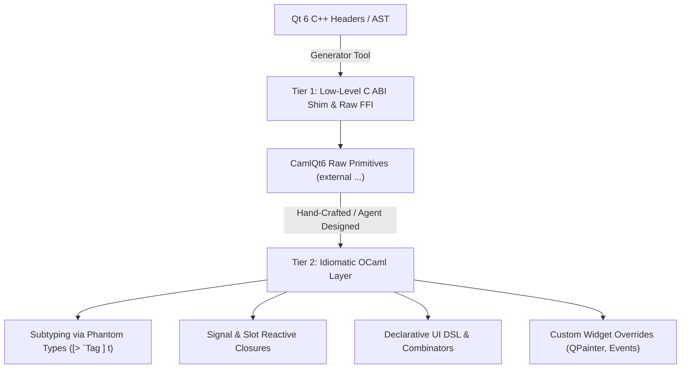

# CamlQt6: Development Plan & Architecture

This document records the strategy behind the library's shape and the state of each phase.

> **Status note (2026-10).** The "hybrid 2-tier generator" architecture described in §1 was
> **evaluated and not adopted.** No code generator is built, and the shipped library is entirely
> hand-written C++ and OCaml — see §1.3. The reasoning is kept below because it still explains why
> the API looks the way it does, but it is not a plan. For what is actually outstanding, see
> [docs/CODE_REVIEW.md](docs/CODE_REVIEW.md).

---

## 1. Code Generation vs. Agent-Driven Development

### The Scale of Qt 6
Qt 6 is one of the largest application frameworks in existence:
- **~1,000+ classes** across Core, Gui, Widgets, Network, Qml/Quick, Svg, Sql, etc.
- **~30,000+ methods** and thousands of enum values.
- Ongoing minor version updates (Qt 6.6, 6.7, 6.8, etc.).

### Why Pure Agent Manual Coding Falls Short for Everything
- **Token Inefficiency:** Writing 30,000 C++/OCaml stubs manually would require millions of tokens and dozens of repetitive sessions.
- **Subtle Drift & Typos:** Over hundreds of files, manual coding invites inconsistencies in naming, pointer casts, and type signatures.
- **Qt Upgrades:** When Qt adds methods or deprecates flags, an automated generator updates the entire FFI surface in seconds by re-running against the new headers.

### Why Pure Code Generation Falls Short for OCaml
- Blindly generating C++ wrappers produces an **un-idiomatic, hostile API** in OCaml:
  - C-style flat argument lists without labeled or optional arguments.
  - Raw integers instead of expressive polymorphic variants for enums and flags.
  - Manual pointer casting instead of type-safe subtyping.
  - No integration with OCaml functional idioms, domain locks, or reactive patterns.

### The Evaluated Architecture: The 2-Tier "Hybrid" Engine — *not adopted*

1. **Tier 1 (would have been automated mechanical FFI):**
   - A deterministic generator (leveraging a Clang AST parser or metadata such as
     [libqt6c/miqt](https://github.com/rcalixte/libqt6c)).
   - Generates the mechanical C wrapper functions and raw OCaml `external` declarations.
2. **Tier 2 (High-Level Idiomatic API):**
   - Labeled/optional arguments and sensible defaults.
   - Expressive variant types for enums and bitflags.
   - Memory ownership contracts and OCaml 5 multicore safety.
   - Declarative layout DSLs (Elm/SwiftUI-style tree builders).
   - Custom widget subclassing trampolines (`paintEvent` dispatching to OCaml canvas renderers).

### 1.3 What was actually built, and why

**Tier 2 only.** Every line of the ~4,400-line C++ stub layer and the OCaml layer above it is
hand-written; the repository has no generator and no generator dependency, and `dune build` needs
nothing but a C++17 compiler and Qt 6.

The deciding factor was coverage rather than philosophy. A generator would have produced tens of
thousands of mechanical wrappers, of which a desktop GUI application needs perhaps a few hundred.
Hand-writing only the useful surface cost more per line and bought:

- typed polymorphic variants instead of integer enum codes, with every encoding mapped through named
  Qt constants;
- labeled and optional arguments throughout;
- a real memory-ownership model (`QPointer` + an `owned` flag + a runtime-checked handle type)
  rather than a generated one that assumes everything is a parented `QObject`;
- hand-tuned event trampolines, the domain-lock protocol, and the reactive `State` layer.

The cost of that choice is the ordinary one: coverage grows slowly, and the gaps are listed in
[docs/CODE_REVIEW.md](docs/CODE_REVIEW.md). The generator's advantage — regenerating the whole FFI
surface in seconds after a Qt upgrade — is real but has not yet been needed; Qt 6 minor versions
have not required regenerating anything.

---

## 2. Phased Delivery

### Phase 1: Essential Desktop UI (The "80/20" Rule) — [COMPLETED]
*Goal: Enable building rich, complete desktop applications with standard widgets.*

1. **Top-Level Windows & Dialogs:**
   - [x] `QMainWindow`: Central widget, menu bar, status bar.
   - [x] `QDialog` (`exec`, `accept`, `reject`, modal state).
   - [x] `QMessageBox` (`information`, `warning`, `critical`, `question`).
   - [x] `QFileDialog` (`get_open_file_name`, `get_save_file_name`, `get_existing_directory`).
2. **Layouts:**
   - [x] `QVBoxLayout`, `QHBoxLayout` (widgets, layouts, stretches, spacing).
   - [x] `QGridLayout` (rows, cols, row/col spans, stretches, spacing).
3. **Core Interactive Widgets:**
   - [x] `QPushButton`, `QCheckBox`, `QRadioButton`, `QComboBox`, `QSpinBox`, `QSlider`, `QProgressBar`.
   - [x] `QTextEdit`, `QLabel`, `QLineEdit`.
4. **Menus, Actions & Shortcuts:**
   - [x] `QAction`, `QMenuBar`, `QMenu`, `QStatusBar`.

---

### Phase 2: Custom Drawing & Event Trampolines — [COMPLETED]
*Goal: Allow OCaml users to build custom interactive widgets, graphics canvases, and visualizations.*

1. **Event Trampolining (`OCamlCanvas : public QWidget`):**
   - [x] `paintEvent` dispatching to OCaml drawing callback with safe painter lifetime management.
   - [x] `mousePressEvent`, `mouseReleaseEvent`, `mouseMoveEvent` with typed coordinates and mouse buttons (`Left_button`, `Right_button`, etc.).
   - [x] `keyPressEvent` dispatching key codes and unicode text strings.
   - [x] `resizeEvent` dispatching current and previous dimensions.
   - [x] `Widget.update` / `Canvas.update` and `set_mouse_tracking`.
2. **2D Graphics & Painting (`QtGui`):**
   - [x] `QColor`: RGB, hex/names, RGBA channels, color presets.
   - [x] `QFont`: Family, size, bold, italic.
   - [x] `QPen`: Colors, stroke widths, styles (`Solid_line`, `Dash_line`, `Dot_line`, `No_pen`).
   - [x] `QBrush`: Colors, styles (`Solid_pattern`, `No_brush`).
   - [x] `QPainter`: `draw_line`, `draw_rect`, `fill_rect`, `draw_rounded_rect`, `draw_ellipse`, `draw_text`, affine transforms (`translate`, `scale`, `rotate`), state stack (`save`, `restore`).
   - [x] Interactive demo: [examples/drawing_canvas.ml](examples/drawing_canvas.ml).

---

### Phase 3: Model / View / Delegate Architecture — [COMPLETED]
*Goal: High-performance data display and tables for data-dense applications.*

1. **Views:**
   - [x] `QTableView`: Grid display, alternating row colors, column/row content auto-resizing, double-click & click signals.
  - [x] Sorting, via `TableModel ~sort`. *(Added after review: Qt's default `QAbstractItemModel::sort`
        is a no-op, so `set_sorting_enabled` originally produced a header that looked sortable and
        silently did nothing.)*
   - [x] `QTreeView`: Expand all, collapse all, tree header.
   - [x] `QListView`: List selection and row click signals.
   - [x] `QHeaderView`: Last section stretch, interactive/stretch/fixed/contents resize modes.
2. **Models:**
   - [x] `QStandardItemModel`: Imperative item-by-item table/tree model with header labels, row appending, clearing, and row/column removal.
   - [x] `TableModel` (`OCamlTableModel : public QAbstractTableModel`): Zero-copy functional table model binding arbitrary OCaml in-memory data structures (arrays of records, tuples, maps) directly into Qt views with `notify_reset` and `notify_data_changed`.
3. **Selection Models:**
   - [x] `QItemSelectionModel`: Current index, selected rows list, selection change notifications.
   - [x] Interactive demo: [examples/table_view_demo.ml](examples/table_view_demo.ml).

---

### Phase 4: Broad Desktop GUI Coverage — [COMPLETED]
*Goal: Scale out to the remaining desktop GUI surface area (strictly GUI-focused; Network, Sql, Svg, and QML are out of scope).*

1. **Advanced Containers & Navigation:**
   - [x] `QTabWidget`: Add/insert/remove tabs, tab titles, tab icons, movable/closable tabs, tab close requests, tab change signals.
   - [x] `QStackedWidget`: Add/remove pages, current index, page transition signals.
   - [x] `QSplitter`: Horizontal/Vertical splitters, stretch factors, programmatic and interactive sizes.
   - [x] `QScrollArea`: Arbitrary child widget embedding, resizable viewport.
   - [x] `QGroupBox`: Titled panels, checkable group boxes, check toggled signals.
2. **Tooling & Dock Panes:**
   - [x] `QToolBar`: Actions, text actions, widget embedding, separators, movable state, `QMainWindow.add_tool_bar`.
   - [x] `QDockWidget`: Left/Right/Top/Bottom docking areas, embedding custom widgets, `QMainWindow.add_dock_widget`.
3. **Desktop Dialogs:**
   - [x] `QColorDialog`: Static color picker (`get_color`) with initial color and custom title.
   - [x] `QFontDialog`: Static font picker (`get_font`) with family, size, weight, italic styles.
   - [x] `QInputDialog`: `get_text`, `get_int` (min/max/step), `get_item` (combo selection).
   - [x] `QProgressDialog`: Asynchronous progress dialog with cancel button and progress tracking.
4. **Desktop Imaging & Assets:**
   - [x] `QPixmap`: In-memory pixel buffer, loading from file, dimension inspection, color filling.
   - [x] `QIcon`: Loading from file, pixmap, or system desktop theme.
   - [x] `QCursor`: Typed mouse cursors (`Pointing_hand`, `Cross`, `Wait`, `I_beam`, etc.) and unsetting.
   - [x] `Painter.draw_pixmap`: Blitting pixmaps onto canvas viewports.
   - [x] Interactive demo: [examples/workbench_demo.ml](examples/workbench_demo.ml).

---

### Phase 5: Declarative / Reactive Functional UI DSL — [COMPLETED]
*Goal: Provide a modern functional reactive programming (FRP) and declarative UI builder on top of Qt 6.*

1. **Lightweight Reactive Signals (`Dsl.State`):**
   - [x] `State.create`, `State.get`, `State.set`, `State.update`.
   - [x] `State.subscribe`: Immediate initial notification and dynamic subscriber dispatching.
   - [x] `State.map`: Zero-boilerplate derived reactive values.
   - [x] `State.map2`: Reactive combination of multiple independent state signals.
2. **Declarative Component Trees (`Dsl`):**
   - [x] Containers & Layouts: `vbox`, `hbox`, `grid`, `split`, `tabs`, `scroll`, `group`, `spacing`, `stretch`.
   - [x] Reactive Control Flow: `cond` (boolean switching) and `match_s` (state-driven multi-branching) backed by `QStackedWidget`.
   - [x] Bidirectional Data Binding: `line_edit`, `text_edit`, `check_box`, `radio_button`, `slider`, `spin_box`, `combo_box`.
   - [x] Reactive Display Elements: `label_s`, `button_s`, `progress_bar`.
   - [x] Custom Widget Integration: `custom` for embedding imperative widgets into declarative trees.
3. **Application Runner:**
   - [x] `Dsl.mount`: Compiles the declarative specification tree into a live Qt widget hierarchy.
   - [x] `Dsl.run`: One-line application execution with automatic event loop setup.
   - [x] Interactive demo: [examples/declarative_todo.ml](examples/declarative_todo.ml).

---

## 3. Immediate Milestones

| Milestone | Deliverables | Target Status |
| :--- | :--- | :--- |
| **M1: Foundational Proof of Concept** | Core types, phantom subtyping, `QApplication`, `QWidget`, `QPushButton`, `QLabel`, `QLineEdit`, `QVBoxLayout`, `QTimer`, automated test suite, example app | **Completed** |
| **M2: Complete Common Widgets & Dialogs (Phase 1)** | `QMainWindow`, `QMenuBar`, `QMenu`, `QAction`, `QStatusBar`, `QDialog`, `QMessageBox`, `QFileDialog`, `QCheckBox`, `QRadioButton`, `QComboBox`, `QSpinBox`, `QSlider`, `QProgressBar`, `QTextEdit`, `QGridLayout`, kitchen sink demo | **Completed** |
| **M3: Event Trampolines & QPainter (Phase 2)** | `OCamlWidget` C++ trampoline class, `paintEvent`, `QPainter`, `QColor`, `QFont`, custom drawing demo | **Completed** |
| **M4: Model / View / Delegate Architecture (Phase 3)** | `QTableView`, `QTreeView`, `QListView`, `QAbstractItemModel` bridge, functional `TableModel` | **Completed** |
| **M5: Broad Desktop GUI Coverage (Phase 4)** | `QTabWidget`, `QStackedWidget`, `QSplitter`, `QScrollArea`, `QGroupBox`, `QToolBar`, `QDockWidget`, `QPixmap`, `QIcon`, `QCursor`, Dialogs (`QColorDialog`, `QFontDialog`, `QInputDialog`, `QProgressDialog`), Workbench demo | **Completed** |
| **M6: Declarative Functional UI DSL (Phase 5)** | Declarative tree combinators, reactive `State`, bidirectional input sync, reactive control flow (`cond`, `match_s`), Todo & Dashboard demo | **Completed** |
