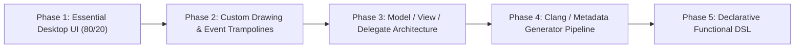

# OQt6: Comprehensive Development Plan & Architecture

This document outlines the strategy for expanding **OQt6** into a full-featured, cross-platform Qt 6 binding for OCaml.

---

## 1. Code Generation vs. Agent-Driven Development

### The Scale of Qt 6
Qt 6 is one of the largest application frameworks in existence:
- **~1,000+ classes** across Core, Gui, Widgets, Network, Qml/Quick, Svg, Sql, etc.
- **~30,000+ methods** and thousands of enum values.
- Ongoing minor version updates (Qt 6.6, 6.7, 6.8, etc.).

### Why Pure Agent Manual Coding Falls Short for Everything
- **Token Inefficiency:** Writing 30,000 C++/OCaml stubs manually would require millions of tokens and dozens of repetitive sessions.
- **Subtle Drift & Typos:** Over hundreds of files, manual coding invites inconsistencies in naming, pointer casts, and type signatures.
- **Qt Upgrades:** When Qt adds methods or deprecates flags, an automated generator updates the entire FFI surface in seconds by re-running against the new headers.

### Why Pure Code Generation Falls Short for OCaml
- Blindly generating C++ wrappers produces an **un-idiomatic, hostile API** in OCaml:
  - C-style flat argument lists without labeled or optional arguments.
  - Raw integers instead of expressive polymorphic variants for enums and flags.
  - Manual pointer casting instead of type-safe subtyping.
  - No integration with OCaml functional idioms, domain locks, or reactive patterns.

### The Recommended Architecture: The 2-Tier "Hybrid" Engine


1. **Tier 1 (Automated Mechanical FFI):**
   - A deterministic generator (leveraging Clang AST parser or the proven [libqt6c/miqt](https://github.com/rcalixte/libqt6c) metadata).
   - Generates the mechanical, non-thinking C wrapper functions and raw OCaml `external` declarations.
2. **Tier 2 (High-Level Idiomatic API - Where Agents Excel):**
   - Labeled/optional arguments and sensible defaults.
   - Expressive variant types for enums and bitflags.
   - Memory ownership contracts and OCaml 5 multicore safety.
   - Declarative layout DSLs (e.g. Elm/SwiftUI-style tree builders).
   - Custom widget subclassing trampolines (e.g. `paintEvent` dispatching to OCaml canvas renderers).

---

## 2. Phased Roadmap to Full Coverage



### Phase 1: Essential Desktop UI (The "80/20" Rule) — [COMPLETED]
*Goal: Enable building rich, complete desktop applications with standard widgets.*

1. **Top-Level Windows & Dialogs:**
   - [x] `QMainWindow`: Central widget, menu bar, status bar.
   - [x] `QDialog` (`exec`, `accept`, `reject`, modal state).
   - [x] `QMessageBox` (`information`, `warning`, `critical`, `question`).
   - [x] `QFileDialog` (`get_open_file_name`, `get_save_file_name`, `get_existing_directory`).
2. **Layouts:**
   - [x] `QVBoxLayout`, `QHBoxLayout` (widgets, layouts, stretches, spacing).
   - [x] `QGridLayout` (rows, cols, row/col spans, stretches, spacing).
3. **Core Interactive Widgets:**
   - [x] `QPushButton`, `QCheckBox`, `QRadioButton`, `QComboBox`, `QSpinBox`, `QSlider`, `QProgressBar`.
   - [x] `QTextEdit`, `QLabel`, `QLineEdit`.
4. **Menus, Actions & Shortcuts:**
   - [x] `QAction`, `QMenuBar`, `QMenu`, `QStatusBar`.

---

### Phase 2: Custom Drawing & Event Trampolines — [COMPLETED]
*Goal: Allow OCaml users to build custom interactive widgets, graphics canvases, and visualizations.*

1. **Event Trampolining (`OCamlCanvas : public QWidget`):**
   - [x] `paintEvent` dispatching to OCaml drawing callback with safe painter lifetime management.
   - [x] `mousePressEvent`, `mouseReleaseEvent`, `mouseMoveEvent` with typed coordinates and mouse buttons (`Left_button`, `Right_button`, etc.).
   - [x] `keyPressEvent` dispatching key codes and unicode text strings.
   - [x] `resizeEvent` dispatching current and previous dimensions.
   - [x] `Widget.update` / `Canvas.update` and `set_mouse_tracking`.
2. **2D Graphics & Painting (`QtGui`):**
   - [x] `QColor`: RGB, hex/names, RGBA channels, color presets.
   - [x] `QFont`: Family, size, bold, italic.
   - [x] `QPen`: Colors, stroke widths, styles (`Solid_line`, `Dash_line`, `Dot_line`, `No_pen`).
   - [x] `QBrush`: Colors, styles (`Solid_pattern`, `No_brush`).
   - [x] `QPainter`: `draw_line`, `draw_rect`, `fill_rect`, `draw_rounded_rect`, `draw_ellipse`, `draw_text`, affine transforms (`translate`, `scale`, `rotate`), state stack (`save`, `restore`).
   - [x] Interactive demo: [examples/drawing_canvas.ml](file:///home/yotam/source/ocaml/oqt6/examples/drawing_canvas.ml).

---

### Phase 3: Model / View / Delegate Architecture — [COMPLETED]
*Goal: High-performance data display and tables for data-dense applications.*

1. **Views:**
   - [x] `QTableView`: Sorting, grid display, alternating row colors, column/row content auto-resizing, double-click & click signals.
   - [x] `QTreeView`: Expand all, collapse all, tree header.
   - [x] `QListView`: List selection and row click signals.
   - [x] `QHeaderView`: Last section stretch, interactive/stretch/fixed/contents resize modes.
2. **Models:**
   - [x] `QStandardItemModel`: Imperative item-by-item table/tree model with header labels, row appending, clearing, and row/column removal.
   - [x] `TableModel` (`OCamlTableModel : public QAbstractTableModel`): Zero-copy functional table model binding arbitrary OCaml in-memory data structures (arrays of records, tuples, maps) directly into Qt views with `notify_reset` and `notify_data_changed`.
3. **Selection Models:**
   - [x] `QItemSelectionModel`: Current index, selected rows list, selection change notifications.
   - [x] Interactive demo: [examples/table_view_demo.ml](file:///home/yotam/source/ocaml/oqt6/examples/table_view_demo.ml).

---

### Phase 4: Generator Tooling for Broad Desktop GUI Coverage
*Goal: Scale out to the remaining desktop GUI surface area (strictly GUI-focused; Network, Sql, Svg, and QML are out of scope).*

1. **Generator Strategy:**
   - Build a generator tool using Clang AST or the [libqt6c](https://github.com/rcalixte/libqt6c) C ABI definitions.
   - Auto-generate:
     - Additional desktop widgets: `QTabWidget`, `QStackedWidget`, `QSplitter`, `QScrollArea`, `QToolBar`, `QDockWidget`, `QGroupBox`.
     - Additional GUI dialogs: `QColorDialog`, `QFontDialog`, `QInputDialog`, `QProgressDialog`.
     - Standard desktop items: `QIcon`, `QPixmap`, `QImage`, `QCursor`, `QKeySequence`.

---

### Phase 5: Declarative / Reactive Functional UI DSL
*Goal: Provide a modern functional reactive programming (FRP) or declarative builder.*

Instead of imperative widget creation:
```ocaml
(* Imperative *)
let win = Widget.create () in
let layout = Layout.VBox.create ~parent:win () in
let btn = Button.create ~text:"Click" () in
Layout.add_widget layout btn;
```

Enable declarative composition:
```ocaml
(* Declarative UI Tree *)
let ui =
  window ~title:"OQt6 Declarative" ~size:(400, 300) [
    vbox ~spacing:10 [
      label "Enter your name:";
      line_edit ~placeholder:"Name..." ~on_change:(fun s -> ...);
      hbox [
        button ~style:`Primary ~on_click:(fun () -> ...) "Submit";
        button ~style:`Secondary ~on_click:(fun () -> ...) "Cancel";
      ];
    ]
  ]
```

---

## 3. Immediate Milestones

| Milestone | Deliverables | Target Status |
| :--- | :--- | :--- |
| **M1: Foundational Proof of Concept** | Core types, phantom subtyping, `QApplication`, `QWidget`, `QPushButton`, `QLabel`, `QLineEdit`, `QVBoxLayout`, `QTimer`, automated test suite, example app | **Completed** |
| **M2: Complete Common Widgets & Dialogs (Phase 1)** | `QMainWindow`, `QMenuBar`, `QMenu`, `QAction`, `QStatusBar`, `QDialog`, `QMessageBox`, `QFileDialog`, `QCheckBox`, `QRadioButton`, `QComboBox`, `QSpinBox`, `QSlider`, `QProgressBar`, `QTextEdit`, `QGridLayout`, kitchen sink demo | **Completed** |
| **M3: Event Trampolines & QPainter (Phase 2)** | `OCamlWidget` C++ trampoline class, `paintEvent`, `QPainter`, `QColor`, `QFont`, custom drawing demo | **Next** |
| **M4: Model / View / Delegate Architecture (Phase 3)** | `QTableView`, `QTreeView`, `QListView`, `QAbstractItemModel` bridge | Planned |
